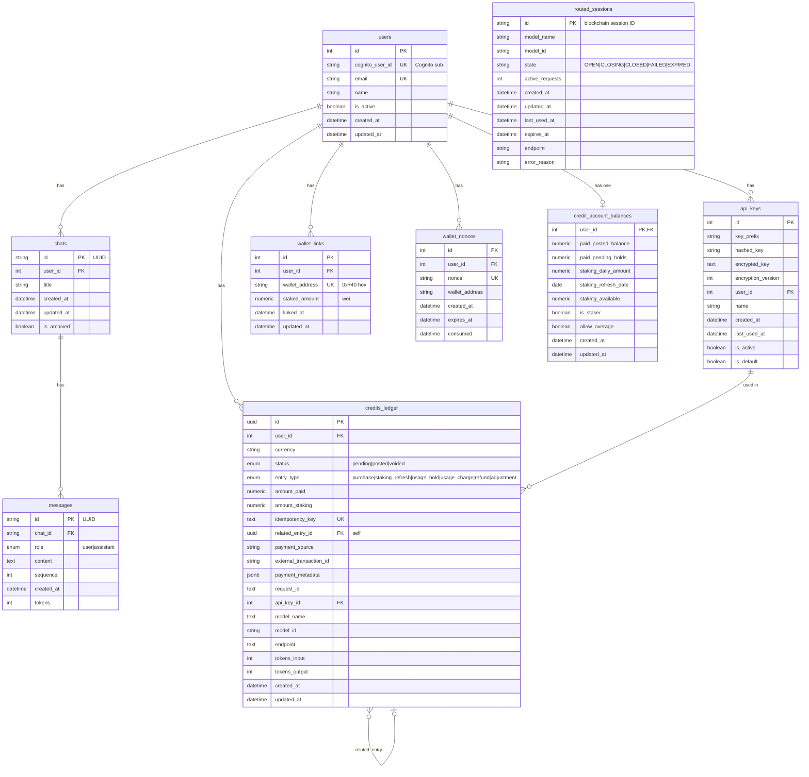

# Morpheus Marketplace API — Database ERD

Entity relationship diagram for the PostgreSQL schema (SQLAlchemy models in `src/db/models/`).

## Mermaid diagram

## Table summary

| Table | Purpose |
|-------|---------|
| **users** | Accounts; identity via `cognito_user_id` (Cognito = source of truth for email). |
| **api_keys** | API keys per user; optional encrypted storage, `last_used_at` for activity. |
| **chats** | Conversation containers; one per user, cascade delete with user. |
| **messages** | Messages in a chat; `role` (user/assistant), `sequence`, optional `tokens`. |
| **wallet_links** | Links Web3 wallets to users; one wallet globally unique; `staked_amount` (wei) for credits. |
| **wallet_nonces** | One-time nonces for wallet linking; expire after 5 min, `consumed` when used. |
| **credits_ledger** | All credit movements (purchase, staking_refresh, usage_hold/charge, refund, adjustment); split `amount_paid` / `amount_staking`; optional link to `api_keys` and self (`related_entry_id`). |
| **credit_account_balances** | Per-user balance cache (paid + staking buckets, `is_staker`, `allow_overage`). |
| **routed_sessions** | Session routing state by model; no FK to users; lifecycle OPEN → CLOSING → CLOSED. |

## Key relationships

- **User** is the central entity: has many api_keys, chats, wallet_links, wallet_nonces; has one credit_account_balances; has many credits_ledger rows.
- **Chat** belongs to one user; has many **messages** (cascade delete).
- **credits_ledger** can reference **api_keys** (for usage_charge) and **credits_ledger** (related_entry_id for refunds/linked entries).
- **routed_sessions** is standalone (model/session lifecycle only).

## Enums

- **messages.role**: `user`, `assistant`
- **credits_ledger.status**: `pending`, `posted`, `voided`
- **credits_ledger.entry_type**: `purchase`, `staking_refresh`, `usage_hold`, `usage_charge`, `refund`, `adjustment`
- **routed_sessions.state**: `OPEN`, `CLOSING`, `CLOSED`, `FAILED`, `EXPIRED`

---

*Generated from `src/db/models/`. Email is sourced from Cognito; DB stores `cognito_user_id`.*
